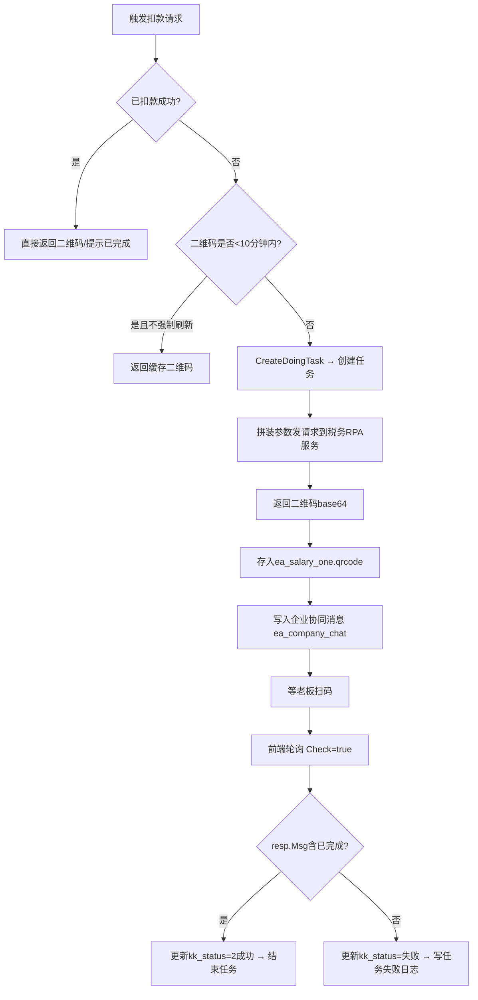

好，代码读完了，下面以**老师的身份**，从业务背景到代码实现，系统讲解个税申报模块。

---

# 个人所得税申报模块 — 全面讲解

---

## 一、业务背景：个税到底申报什么

代账公司帮企业做个税，主要涉及两大场景：


| 场景          | 收入类型       | 税率算法      | 对应工资表类型                            |
| ----------- | ---------- | --------- | ---------------------------------- |
| 普通员工        | 综合所得（工资薪金） | **累计预扣法** | `ea_salary_sheet.wage_type = 工资薪金` |
| 劳务报酬        | 一次性劳务      | 次次独立计算    | `wage_type = 劳务报酬`                 |
| 个独/经营所得（查账） | 经营所得       | 五级超额累进    | `wage_type = 个人生产经营所得(查账)`         |
| 个独/经营所得（核定） | 核定征收       | 按征收率固定比例  | `wage_type = 个人生产经营所得(核定征收)`       |


---

## 二、系统功能全貌（架构图）

```
┌─────────────────────────────────────────────────────────────────────┐
│                        个人所得税申报模块                             │
│                                                                      │
│  ① 工资数据录入                                                       │
│     ea_salary_sheet（工资表）                                         │
│     ea_salary（每人每月明细）                                          │
│     ea_employee（员工档案，含专项附加扣除信息）                         │
│                  ↓                                                   │
│  ② 个税自动计算（核心）                                               │
│     GsTax()        → 工资薪金  → 累计预扣法                           │
│     GsTaxLwbc()    → 劳务报酬  → 次次独立                             │
│     GsTaxGr()      → 经营所得  → 五级税率                             │
│                  ↓                                                   │
│  ③ 累计数据存档                                                       │
│     ea_salary_period（每月累计快照）                                   │
│                  ↓                                                   │
│  ④ 个税申报（提交税局）                                               │
│     普通工资 → 发任务走 tax_task_main 申报队列                         │
│     经营所得 → PersonalTaxPay() 扫二维码缴款                           │
│                  ↓                                                   │
│  ⑤ 申报状态跟踪                                                       │
│     tax_task_detail.kk_status / task_status                          │
└─────────────────────────────────────────────────────────────────────┘
```

---

## 三、最核心的算法：累计预扣法（`GsTax`）

这是中国个税现行计算方式，系统实现在 `service/s_ea/salary_gs_tax.go`。

### 核心公式

```
本月代扣个税 = 累计应交税款 - 上月累计已交税款

其中：
  累计应纳税所得额 = 累计收入 - 累计免税收入 - 累计减除费用 (每月5000)
                   - 累计专项扣除（社保公积金）
                   - 累计专项附加扣除（7项）
                   - 累计其他扣除（个人养老金等）

  累计应交税款 = couTax(累计应纳税所得额)   ← 查七级超额累进税率表
```

### 七级超额累进税率表（`couTax` 函数实现）

```507:527:service/s_ea/salary_gs_tax.go
func couTax(mon float64) float64 {
    if mon <= 36000 {
        tax = mon * 0.03             // 3%
    } else if mon <= 144000 {
        tax = mon*0.1 - 2520         // 10%
    } else if mon <= 300000 {
        tax = mon*0.2 - 16920        // 20%
    } else if mon <= 420000 {
        tax = mon*0.25 - 31920       // 25%
    } else if mon <= 660000 {
        tax = mon*0.3 - 52920        // 30%
    } else if mon <= 960000 {
        tax = mon*0.35 - 85920       // 35%
    } else {
        tax = mon*0.45 - 181920      // 45%
    }
}
```

### 专项附加扣除 7 项（`getZxkcMon` 函数）

系统支持 7 项专项附加扣除，全部存在 `ea_employee` 表的员工档案里，并且有**起止时间**控制：


| 编号      | 字段                    | 中文名       |
| ------- | --------------------- | --------- |
| `Time1` | `ChildrenEducation`   | 子女教育      |
| `Time2` | `ContinuingEducation` | 继续教育      |
| `Time3` | `SeriousIllness`      | 大病医疗      |
| `Time4` | `HousingLoan`         | 住房贷款利息    |
| `Time5` | `HousingRent`         | 住房租金      |
| `Time6` | `Support`             | 赡养老人      |
| `Time7` | `BabyReduction`       | 3岁以下婴幼儿照护 |


`getZxkcMon` 的作用：根据专项附加扣除的**开始月、结束月、入职日期、当前账期**，算出**本年累计该扣多少月**。

---

## 四、三种工资类型的税算方法对比

### ① 工资薪金 — `GsTax()`

- **位置**：`service/s_ea/salary_gs_tax.go`
- **特点**：**跨月累计**，每月算出当月代扣额（今年到本月累计税款 - 上月已扣税款）
- **关键**：从 `ea_salary_period` 取上月累计快照，每次计算完写入本月快照


### ② 劳务报酬 — `GsTaxLwbc()`

- **位置**：`service/s_ea/salary_gs_tax_lwbc.go`
- **特点**：每次独立计算，不累计
- **税率规则**：

```16:34:service/s_ea/salary_gs_tax_lwbc.go
srTotal = 收入 - 免税收入 - 社保 - 其他

if srTotal <= 800:        税 = 0
elif srTotal <= 4000:     税 = (收入 - 800) × 20%
elif 含税所得 × 80% <= 20000:  税 = (收入 × 80%) × 20%
elif 含税所得 × 80% <= 50000:  税 = (收入 × 80%) × 30% - 2000
else:                     税 = (收入 × 80%) × 40% - 7000
```

### ③ 经营所得 — `GsTaxGr()`

- **位置**：`service/s_ea/salary_gs_tax_one.go`
- **特点**：用**五级超额累进税率**（`couTaxgr2`），对应个独/合伙企业
- **两种征收方式**：
  - **查账征收**：用实际利润（收入 - 成本 - 弥补以前年度亏损）× 分配比例 - 减除费用
  - **核定征收**：用收入 × 征收率，更简单

---

## 五、西藏边疆地区特殊处理

系统里还有一个特殊分支，西藏地区因国家政策有附加免税额：

- 企业设置了 `code_xzgs`（西藏工资设置），按**一二三四类地区**分别有 4000 / 4000 / 4400 / 4800 元的附加减除
- 公式：`西藏附加减除 = 当月收入 - 免税收入 - 代扣社保 - 5000元 - 本月专项附加扣除`，取不超过上限的部分

```51:51:service/s_ea/salary_gs_tax.go
func GsTax(salary model.EaSalary, session model.UserSession, txItem *gorm.DB) (err error) {
```

这个函数里第 79-191 行就专门处理西藏分支，是 `202601` 账期之后加的新逻辑。

---

## 六、经营所得扣款（`PersonalTaxPay`）—— 扫二维码专用

个独/经营所得比较特殊，**不走普通申报队列**，而是单独扫二维码扣款。代码在 `service/s_tax/personalTax.go`。




关键点：

- 二维码**10分钟有效**，过期需要重新请求
- 获取到二维码后，会写入**企业协同消息**，通知老板扫码（`ea_company_chat`）
- 扣款结果通过 **前端主动轮询**（`Check=true`参数）来触发状态更新

---

## 七、关键数据表总结


| 表名                       | 说明                        |
| ------------------------ | ------------------------- |
| `ea_salary_sheet`        | 工资表（按账期，含工资类型、收入/成本合计）    |
| `ea_salary`              | 每人每月工资明细（含各项扣除、代扣个税）      |
| `ea_salary_one`          | 个独/劳务人员申报数据（含二维码、缴款状态）    |
| `ea_employee`            | 员工档案（含7项专项附加扣除、入职日期、地区类别） |
| `ea_salary_period`       | 每月累计快照（累计收入、累计扣除、累计已交税款）  |
| `ea_salary_remuneration` | 劳务报酬明细                    |
| `tax_task_main`          | 申报任务主表（含状态追踪）             |
| `tax_task_detail`        | 申报任务明细（含reqNo、缴款状态）       |


---

## 八、整体流程回顾

```
员工档案录入（含专项附加扣除）
    ↓
录入本月工资（薪酬/劳务/经营所得）
    ↓
触发个税计算（GsTax / GsTaxLwbc / GsTaxGr）
    ↓（累计预扣/次次计算/经营所得）
写入代扣个税到 ea_salary.deduct_income_tax
    ↓
工资一键生成凭证
    ↓
发起个税申报
  → 工资薪金：走 tax_task_main 申报队列
  → 经营所得：PersonalTaxPay() 生成二维码 → 老板扫码缴款
    ↓
状态跟踪（排队中 → 申报中 → 成功/失败）
```

---

## 九、维护这个模块最容易踩的坑

1. **累计快照的顺序依赖**：`GsTax` 严格依赖上一期的 `ea_salary_period`，如果某月补录或修改，必须确保后续月份重新触发计算。
2. **专项附加扣除的时间边界**：7项扣除都有 `Time`/`TimeEnd`，`getZxkcMon` 里按入职日期和账期做比较，字符串截取月份时务必确认格式。
3. **经营所得二维码有 10 分钟限制**：前端轮询时要注意避免频繁刷新导致重复创建任务。
4. **西藏特殊逻辑是 `202601` 之后**：代码里用 `model.IsNewDeductOtherPeriod(session.Period)` 做版本判断，改这块逻辑一定要两个分支都测。

