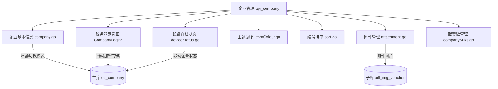

基于代码，下面对「板块二：企业（账套）管理」的每个功能做详细讲解。

---

## 板块二：企业（账套）管理

**核心目录**：`api/api_company/`（25 个文件）

---

### 1. 企业列表、新增、信息维护

**文件**：`api/api_company/company.go`

- **`EaCompanyList`**：查询当前机构下企业列表，支持状态筛选、关键词搜索等。
- **`SaveEaCompany`**：新增或修改企业，支持批量操作（传 `list` 数组）。关键点：
  - 按 `UserId` 加 Redis 锁防并发
  - 修改时先调 `common.Authentication(company.ID, session.OrgId)` 做**归属校验**（防止跨机构篡改）
  - 成功/失败分开返回，批量操作不会因一条失败而全部回滚

```48:89:api/api_company/company.go
func SaveEaCompany(c *gin.Context) {
    // ...加锁、参数绑定...
    for _, company := range query.List {
        if company.ID != 0 {
            if err = common.Authentication(company.ID, session.OrgId); err != nil {
                // 跨机构操作直接拒绝，加入失败列表
                continue
            }
        }
        err = s_ea.SaveCompany(company, session, txMain, txItem, false, true)
        // 失败加 callData，最终返回成功/失败总数
    }
```

- **`EaCompanyInfo`**：获取单个企业详情。
- **`DelCompany` / `DelCompanyNew`**：删除企业，新版有更多校验（如是否有未结算数据）。

---

### 2. 账套切换

**函数**：`ChangeStatus`（实际改的是企业 `status` 字段）

企业在系统里有不同状态，核心逻辑：
- 从"新客户"转"记账客户"时，校验当前机构账套数是否超限（`OrgAddCompanyCount`）
- 超限且非旗舰版直接报错
- AI 工厂客户不允许手动切换，要先"移除工厂"

| status 值 | 含义 |
|-----------|------|
| 1 | 新客户（潜在） |
| 2 | 记账客户 |
| 3 | 停报客户 |
| 9 | 注销/删除 |

---

### 3. 企业颜色标记

**文件**：`api/api_company/comColour.go`

这里的"颜色"实际是**品牌主题配置**（属于代账机构的个性化）：

```14:40:api/api_company/comColour.go
type ComColourParamSt struct {
    Logo, LoginImg, UnfoldLogo, FoldLogo, MenuBg  // 各种 logo
    Colour1~Colour5   // 主题色 1-5
    Title, DomainName // 机构标题、域名
    PrefixName        // 短信前缀
    // ...短信模板、AccessKey 等
}
```

每个集团（`GroupId`）对应一套主题，存在主库 `com_colour` 表。域名和主题色通过 `PublicComColourList` 根据 `Origin` 请求头自动匹配，实现**私有化部署换肤**。

---

### 4. 企业排序（编号）

**文件**：`api/api_company/sort.go`

- `SortCom`：对企业批量生成**编号**（如 `A001`、`A002`），而不是简单的拖拽排序
- 编号规则：`前缀 + 定长数字`，如 `pre="A"、len=3` → `A001、A002...`
- 支持过滤"自动记账企业"和"记账/新客户"状态

```84:98:api/api_company/sort.go
thisSortComNo := fmt.Sprintf("%s%0"+utils.IntToStr(l)+"d", pre, 0)
for _, company := range list {
    thisSortComNo, err = getSortNum(thisSortComNo, pre, l, sortNames)
    company.UpdateOne(utils.H{"sort_com": thisSortComNo}, txMain)
}
```

---

### 5. 企业续费、账套数管理

**函数**：`ChangeStatus` 里的 `OrgAddCompanyCount` 校验 + `companySuks.go`

- `OrgAddCompanyCount`：查当前机构的"购买账套数上限"和"已用数量"
- 超限时拒绝将企业转为记账状态（旗舰版不受此限制）
- `CompanySuksList`（`companySuks.go`）：查询企业绑定的**三方协议**信息（如 API 授权协议等）

---

### 6. 企业税务登录凭证管理

**文件**：`api/api_company/company.go` 中 `CompanyLogin*` 系列函数

这是板块二里**最重的功能**，存的是企业登录电子税务局的账号密码体系：

| 函数 | 作用 |
|------|------|
| `CompanyLoginList` | 查企业绑定的登录方式列表（按 `login_method` 分组） |
| `CompanyLoginUserList` | 查机构下所有办税人（含设备在线状态、切换次数限制） |
| `CompanyLoginComList` | 查登录用户对应的企业列表 |
| `CreatCompanyLoginUser` | 新增办税人账号（存 `ea_company_login_user` 表） |
| `CompanyLoginUserUpdate` | 修改办税人信息 |
| `DeleteCompanyLoginUser` | 删除办税人 |
| `CompanyLoginDecrypt` | 解密密码（加密存储，查看时解密） |
| `CancelCompanyLoginCom` | 解绑企业与办税人的关联 |

---

### 7. 企业在线状态（授权状态）

**文件**：`api/api_company/deviceStatus.go`

企业在线状态实际上是**办税设备是否在线**，用于判断能否发起税务申报任务：

```61:86:api/api_company/deviceStatus.go
func UpdateDeviceStatus(offlineMobiles, newOnlineMobiles []string, txMain *gorm.DB) {
    // 离线设备：device_status = 0
    // 在线设备：device_status = 1
}
```

`UpdateDeviceStatusWithKeepStatus`：在更新设备状态后，联查该设备绑定的所有企业，同步更新企业的 `keep_status`（税务保持状态，影响前端显示"设备在线"/"已授权"/"未授权"）。

流程：
```
设备状态变更（上线/下线）
  → 找到该设备关联的所有 ComId
  → 遍历 UpdateBaseKeepStatus(comId)
  → 更新 ea_company.keep_status
```

---

### 8. 企业附件管理

**文件**：`api/api_company/attachment.go`

- `UploadBill`：上传企业附件（支持多张 Base64 图片），分两类：
  - 有账期的票据（发票/银行回单）
  - 无账期的通用附件（`period = "fj_no_period"`）
- `DelBill`：删除附件，**已生成凭证的不允许删除**

附件最终存到 `bill_img_voucher` 表（子库），OSS 路径存储到 `url_img` 字段。

---

## 整体模块关系图



---

如果你想深入某个具体功能（比如"税务登录凭证的加解密机制"或"设备在线状态的完整链路"），可以告诉我，我可以进一步读取对应代码讲解。