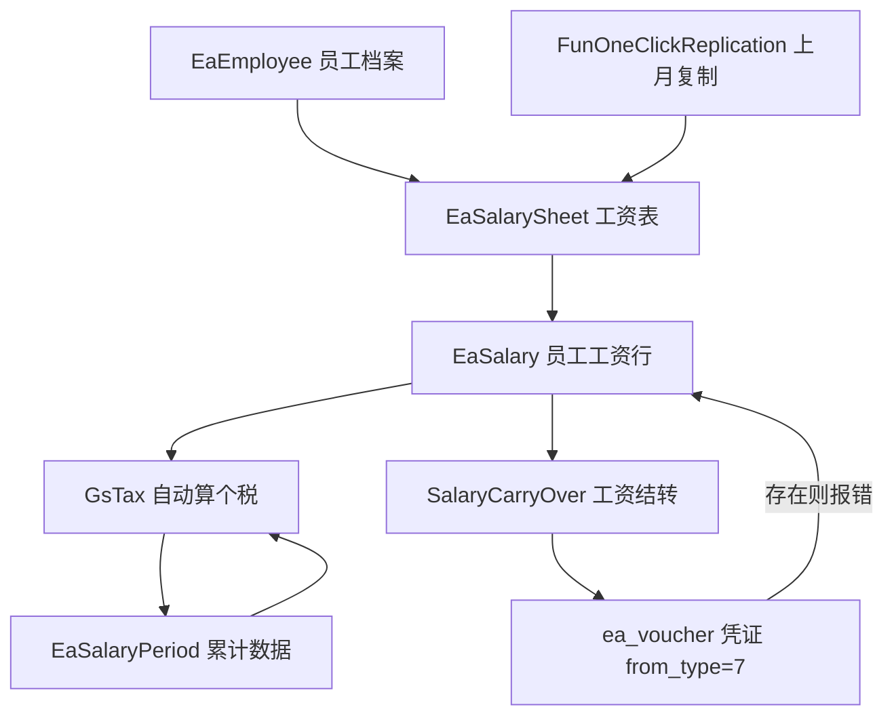

好了，代码已经全面探索完毕，下面给你做一次完整的讲解。

---

## 工资薪酬模块（板块九）整体解读

---

### 一、模块文件全览

```
api/salary/           ← HTTP 接口层（8个文件）
service/s_ea/         ← 业务逻辑层（14个 salary_* 文件）
```

---

### 二、核心数据结构（三层关系）

```
EaSalarySheet（工资薪酬表）  ← 每个账期可以有多张，代表一种"工资类型"
  └── EaSalary（员工工资行）  ← 每张表里每个员工一行
        └── EaSalaryPeriod（累计数据）  ← 个税累计预扣用

EaEmployee（员工档案）       ← 员工基本信息+专项附加扣除信息
```

---

### 三、按功能逐点讲解

#### 1. 员工档案管理

文件：`api/salary/emp.go` + `service/s_ea/salary_emp.go`

接口：

| 函数             | 作用                                    |
| ---------------- | --------------------------------------- |
| `SaveEmployees`  | 新增/修改员工（含离职日期、证件号查重） |
| `EaEmployeeList` | 员工列表                                |
| `DelEaEmployee`  | 删除员工                                |

关键点：

- 身份证号全局**唯一**校验（同一企业内，`BINARY id_no` 精确匹配）。
- 员工类型 `IsEmployee`：`1` 正式雇员、`3` 临时工，两种工资表是分开的，不能互串。

---

#### 2. 工资表创建与录入

文件：`api/salary/sheet.go` + `service/s_ea/salary_sheet.go`

接口：

| 函数                | 作用                              |
| ------------------- | --------------------------------- |
| `SaveEaSalarySheet` | 创建或修改工资薪酬表（类型+账期） |
| `SalarySheetList`   | 工资表列表                        |
| `DelEaSalarySheet`  | 删除工资表（含级联删除明细）      |

支持的 **7 种工资类型**（定义在 `salary_salary.go`）：

```go
SalaryWageType1 = "正常工资薪资"
SalaryWageType2 = "个人生产经营所得(查账征收)"
SalaryWageType3 = "劳务报酬所得"
SalaryWageType4 = "全年一次性奖金"
SalaryWageType5 = "个人生产经营所得(核定征收)"
SalaryWageType6 = "临时工工资表"
SalaryWageType7 = "解除劳动合同一次性补偿金"
```

**保存工资数据** 走 `SaveEaSalary` → `SaveSalary`：

- Redis 锁防并发
- 检查当前账期有没有已生成的"工资结转凭证"（`from_type=7`），有则报错**先删除凭证才能改工资**
- 每个员工每张表只能有一行（唯一性校验）
- 批量保存前还会检查"是否所有正式员工都填了工资"（`NoSalaryEmployeeCount`）

---

#### 3. 工资个税自动计算（累计预扣法）

文件：`service/s_ea/salary_gs_tax.go`

这是整个工资模块**最核心**的逻辑，`GsTax` 函数按**累计预扣法**自动算出每个员工本月应扣税：

```
累计应纳所得额 =
  累计收入
  - 免税收入（西藏等地区）
  - 累计减除费用（5000/月 × 月数）
  - 累计专项扣除（社保+公积金）
  - 累计专项附加扣除（七项）
  - 累计个人养老金
  - 其他扣除

本月代扣税 = couTax(累计应纳所得额) - 上月累计已扣税
```

**七项专项附加扣除**：

| 变量                   | 含义          |
| ---------------------- | ------------- |
| `children_education`   | 子女教育      |
| `continuing_education` | 继续教育      |
| `serious_illness`      | 大病医疗      |
| `housing_loan`         | 住房贷款      |
| `housing_rent`         | 住房租金      |
| `support`              | 赡养老人      |
| `boby`                 | 3岁以下婴幼儿 |

每项都有`开始时间/结束时间`控制生效月数，由 `getZxkcMon(...)` 自动计算应扣月数。

`couTax(amount)` 是按**七级超额累进税率**（3%~45%）计算税额的函数。

---

#### 4. 社保公积金自动计算

嵌入在 `SaveSalary` 流程里，也有专门的设置接口：

| 函数                  | 作用                   |
| --------------------- | ---------------------- |
| `SalarySocialSetOne`  | 保存企业社保公积金设置 |
| `SalarySocialSetList` | 查询设置列表           |

工资行里的字段：`DeductSbPension`（养老）、`DeductSbMedical`（医疗）、`DeductSbUnemployment`（失业）、`DeductSbOther`（其他）、`DeductHouseFund`（公积金）。

---

#### 5. 工资一键生成凭证

由结转模块完成，路口在 `FunOneKeyVoucher(Type=="")` 时触发 `SalaryCarryOver`：

| 结转函数                   | 对应场景           |
| -------------------------- | ------------------ |
| `SalaryCarryOver`          | 正常工资结转       |
| `TemporarySalaryCarryOver` | 临时工工资结转     |
| `SalayLwbc`                | 劳务报酬结转       |
| `SalayOnly`                | 年终奖等特殊结转   |
| `SalayJysd`                | 个人生产经营所得   |
| `SalayIndemnity`           | 解除劳动合同补偿金 |

生成的凭证 `from_type = 7`（工资来源），**也是检查是否能修改工资的依据**（有工资凭证 → 先删凭证才能改工资）。

---

#### 6. 工资数据复制（上月复用）

文件：`service/s_ea/salary_copy.go`，核心函数 `FunOneClickReplication`、`CopySalaryNew`

逻辑：

- 从上月工资表复制员工数据到当期（复制 `SalarySheet` + 所有 `Salary` 明细）。
- 支持 `bfb` 比例参数（按比例复制金额，如打九折）。
- 按工资类型有不同复制函数：`CopySalarySalaryWageType1/2/3/5/6`。
- 复制前校验当期是否已有工资表，**防止重复**。

---

#### 7. 薪酬汇总报表

`SalaryHzList`（`api/salary/salary.go` → `service/s_ea/salary_salary.go`）：

按部门/员工维度汇总实发工资、代扣税、社保等，用于管理查阅。

---

### 四、模块关系图



---

### 五、阅读顺序建议

1. `service/s_ea/salary_salary.go` → `SaveSalary` 看整体保存链路
2. `service/s_ea/salary_gs_tax.go` → `GsTax` 看累计预扣法个税核心
3. `service/s_ea/salary_copy.go` → `CopySalaryNew` 看复制逻辑
4. `api/salary/sheet.go` → `SaveEaSalarySheet` 看工资表创建
5. 一键凭证结转回到凭证模块看 `SalaryCarryOver`

如果你想深入某一块（比如个税计算的超额累进税率函数、劳务报酬的处理差异等），告诉我可以进一步细讲。
