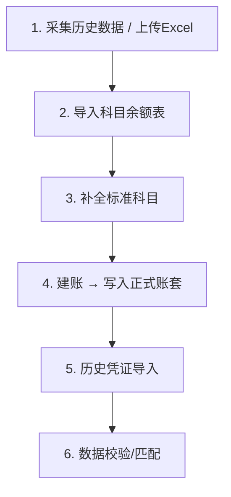

好，根据代码，现在可以给你详细讲解**板块三：建账初始化**。

---

## 核心定位

建账初始化是**新企业入账前的一次性准备工作**，主要针对**从其他软件迁移过来的企业**（如用友、金蝶迁移到鲸算盘），目标是把历史科目体系、期初余额、历史凭证都完整导入进来。

和日常使用的账套数据不同，建账过程使用的是**单独的 `init_*` 临时表**（在主库），建账完成后才正式写入账套子库的 `ea_*` 正式表。

---

## 整体流程



---

## 各子功能详解

### 1. 导入科目余额表（建账第一步）

`s_createBook.SubjectInitImport()`

- 接收前端上传的**科目余额表 Excel 解析结果**（`[]model.EaSubjectBalanceInit`）
- 核心逻辑：
  - 先清空本企业旧的 `ea_subject_balance_init` 暂存数据
  - 调用 `SubjectFormat` 处理科目编码格式（`4-2-2` 等分级规则、分隔符处理）
  - 调用 `FindBuildNewCode` 智能生成新编码：
    - 找父科目（`UpperLevel`）
    - 找兄弟科目（同级），取最大编码 `+1`（`utils.Plus1`）
    - 若父级也不存在就报错
  - 调用 `FindBuildSubjectAll` 匹配标准科目库（4、5、6 开头科目按编码+名称同时匹配）
  - 特殊处理：`2221` 开头的应交税费，进项/减免/已交等子科目**强制为借方**
  - 结果存入 `ea_subject_balance_init` 暂存表（主库）

### 2. 补全标准科目（建账第二步）

`s_createBook.SubjectInitImportTwo()`

- 取出当前企业准则对应的**标准科目库** `GetBaseSubjects`
- 对每个标准科目，检查暂存表里是否已经存在（`BuildSubjectExist`）
- **不存在的科目自动补全进去**，确保标准科目体系完整
- 同时生成 `ea_subject_old_new` 科目映射表（旧编码 → 新编码），用于后续历史凭证中科目替换

### 3. 建账（建账第三步，正式写入）

`s_createBook.SubjectInitImportThree()`

- **防重复校验**：先查子库 `ea_subject` 是否已有数据，有则报错
- 取企业 `StartAccountPeriod`（启用账期），算出上一期 `lastPeriod` 作为期初余额账期
- 遍历暂存表数据：
  1. 插入 `ea_subject`（会计科目树），用 `changedCodeMap` 维护编码→ID 映射，处理父子关系
  2. 按借贷方向计算期末余额：
     - 借方科目：`endIn = 期初借 - 期初贷 + 本期借 - 本期贷`
     - 贷方科目：`endOut = 期初贷 - 期初借 + 本期贷 - 本期借`
  3. 插入 `ea_subject_balance`（科目余额表）到账套子库

### 4. 历史凭证导入

`api/api_init/build.go` 中的 `CreateHisSendMq`

- 通过 MQ（消息队列）异步处理，发送任务
- 调用 `s_init.CreateHisSendMq`，将历史凭证数据批量写入 `init_voucher_pre`（预览暂存）
- 凭证数据来源：采集任务从税务局或 Excel 导入的 `init_voucher_pre`/`init_voucher_item_pre`

### 5. 数据校验与状态追踪

`api/api_init/list.go` 中的 `CompanyInitList`

- 返回每个企业的完整建账进度，状态字段包括：
  - `jz_status`：建账状态（0未建账/1已建账/2失败）
  - `bq_status`：科目补全状态
  - `task_status`：采集任务状态（排队中/采集中/成功/失败）
  - `import_task_status`：导入任务状态
  - `match_task_status`：历史数据匹配状态
  - `jy_status`：数据校验状态

---

## 关键数据表（全在主库 `init_*` 命名）

| 表名                          | 用途                           |
| ----------------------------- | ------------------------------ |
| `init_company`                | 采集到的企业基本信息（迁移前） |
| `ea_subject_balance_init`     | 建账第一步暂存的科目余额       |
| `ea_subject_old_new`          | 旧编码→新编码映射              |
| `init_voucher_pre`            | 历史凭证预览（未正式导入）     |
| `init_voucher_item_pre`       | 历史凭证明细预览               |
| `init_subject`                | 建账后的科目表（临时）         |
| `init_subject_balance`        | 建账后的科目余额（临时）       |
| `init_asset`                  | 历史固定资产                   |
| `init_employee`               | 历史员工档案                   |
| `init_inventory_period`       | 历史存货                       |
| `init_in_invoice_uncertified` | 历史未认证进项发票             |

---

## 和日常账套的关系

```
init_* 表（主库）  →  建账完成  →  ea_* 表（子库，正式账套）
                                  ↑
                           SubjectInitImportThree 写入
```

建账完成前，所有数据都在 `init_*` 暂存，用户可以反复调整；只有明确点击"建账"（第三步）才会把数据写进账套子库，之后就不能再重复导入（有防重校验）。
