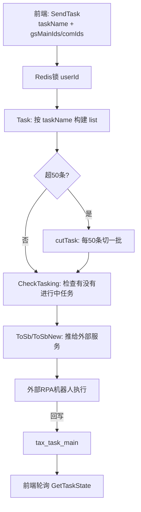

好，代码已经读清楚了，下面是完整的税务申报模块讲解。

---

## 税务申报模块整体架构

```
前端请求
  └─ POST /sendTask（api/tax/sendTask.go）
       └─ FunSendTask()
            ├─ Task()：按 taskName 参数构建任务列表
            ├─ CheckTasking()：检查是否有未完成的同类任务
            └─ ToSb() / ToSbNew()：推送到外部申报服务
                  └─ 外部 RPA / 自动化机器人（SendTaskUrl）
                       └─ 反回执写入 tax_task_main
                            └─ 前端轮询 /getTaskState 查询进度
```

系统核心是**任务化驱动**：一切操作（申报/扣款/采集/作废）都统一抽象成 `TaskName` 任务，推给外部自动化服务执行，本系统只负责「构建任务、发出、追踪状态」。

---

## 一、核心数据表

### `tax_task_main`（主库）

| 字段                              | 说明                           |
| --------------------------------- | ------------------------------ |
| `com_id` + `period` + `task_name` | 唯一定位一条任务               |
| `req_no`                          | 外部服务返回的流水号，用于对账 |
| `task_status`                     | 任务状态（见下表）             |
| `bussiness_status`                | 业务状态（更细粒度）           |
| `bussiness_log`                   | 业务日志（失败原因等）         |
| `image`                           | 申报截图（外部服务回写）       |
| `amount1/2/3`                     | 申报金额、应缴税额等           |

**`task_status` 状态值**

| 值  | 含义                  |
| --- | --------------------- |
| 1   | 进行中（排队/执行中） |
| 2   | 成功/已完成           |
| 3   | 失败                  |

**`bussiness_status` 常量（`model/tax/taxTaskMain.go`）**

| 值  | 含义                 |
| --- | -------------------- |
| 2   | 通用成功             |
| 3   | 通用失败             |
| 20  | 发起申报任务         |
| 77  | 等待用户扫二维码缴款 |
| 78  | 扣款检查中           |

### `gs_main`（子库，账套数据）

每一张税表对应一条 `gs_main` 记录，通过 `table_name` 区分税种：

| `table_name`     | 税种                 |
| ---------------- | -------------------- |
| `gs_vat`         | 增值税（一般纳税人） |
| `gs_small_vat`   | 增值税（小规模）     |
| `gs_tax_quarter` | 企业所得税季报       |
| `gs_cbj`         | 附加税               |
| `gs_sl`          | 水利建设专项收入     |
| `gs_xfs`         | 消费税               |
| `gs_deed`        | 行为税（印花税等）   |
| ...              | 更多税种             |

---

## 二、TaskName 体系（任务名称设计）

任务名称遵循 **`操作-税种`** 格式，在 `config/taxConstants.go` 里定义：

```
tax-sb-{税种}     → 申报
tax-kk-{税种}     → 缴款（扣款）
tax-gz-{税种}     → 更正
tax-zf-{税种}     → 作废
```

举例：

| 任务名              | 含义                                                       |
| ------------------- | ---------------------------------------------------------- |
| `tax-sb-smallVat`   | 小规模增值税申报                                           |
| `tax-sb-vat`        | 一般纳税人增值税申报                                       |
| `tax-kk-taxQuarter` | 企业所得税缴款                                             |
| `tax-sb`            | 通用申报入口（前端传 gsMainIds，代码再按 table_name 转换） |
| `tax-kk`            | 通用缴款入口                                               |
| `tax-gz`            | 通用更正入口                                               |
| `tax-zf`            | 通用作废入口                                               |

映射规则在 `service/s_ea/s_name/TableNameToTaskName(tableName, action)` 里维护。

---

## 三、主业务流程（SendTask）



### `Task()` 的核心职责：把前端参数转成 `[]SendTaskParamSt`

前端有两种传法：

- 传 `gsMainIds`（知道具体税表）→ `task_name = "tax_sb"/"tax_kk"/"tax_gz"/"tax_zf"` 时走这个分支，通过 `TableNameToTaskName` 翻译出具体 `task_name`
- 传 `comIds + period`（批量操作）→ 采集、汇算清缴、发票采集等走这里，每个 `comId` 生成一条任务

**申报时的联动校验（`Task()` 里）**：

- 小规模增值税 + 定期定额必须**同时发起**申报（不能只选其中一个）
- 若同时还有水利建设收入，三个需要**同时发起**
- 否则报错阻止

### `ToSbNew()` / `ToSb()` 的职责

把任务列表序列化后 HTTP POST 到 `config.SystemConfig.Server.SendTaskUrl`（外部自动化服务）。

返回后按状态分三类：

- `doings`：成功排队，写入 `doing` 状态
- `errs`：发起失败，记录错误日志
- `queues`：「已存在」的任务（跳过重复）

---

## 四、预申报（PreDeclaration）

```59:163:api/tax/sendTask.go
// 发起任务之后，需要清除预申报的状态
var gsMains []gs.GsMain
txItem.Model(&gs.GsMain{}).Where("id in ?", param.GsMainIds).Find(&gsMains)
// ...
err = txMain.Model(&tax.TaxTaskMain{}).Where("period = ? AND com_id IN ? AND task_name = ?", period, comIds, config.PreDeclaration).Updates(utils.H{
    "task_status":      2, // 改成2说明已经发起任务了
    "bussiness_status": 20,
    "bussiness_log":    "发起申报任务",
}).Error
```

预申报是正式申报前的一步，发起正式申报后会把预申报记录的 `task_status` 改为 2（已完成）。

---

## 五、任务状态查询（GetTaskState）

```13:43:api/tax/getTaskState.go
func GetTaskState(c *gin.Context) {
    // 按 com_id + period + task_name 查最新一条 tax_task_main
    txMain.Model(&tax.TaxTaskMain{}).
        Where(`com_id = ? and period = ? AND task_name = ?`, q.ComId, q.Period, q.TaskName).
        First(&taskDetail)
    common.Ok(c, taskDetail)
}
```

前端**轮询**这个接口，拿到 `task_status` / `bussiness_status` / `image`（截图） / `err_log` 等实时更新 UI。

---

## 六、缴款（扣款）特殊逻辑

税款缴纳分两种方式：

1. **直接扣款**：外部服务自动完成，通过 `tax-kk-*` 任务
2. **二维码扫码**（个独/个人生产经营）：
   - 调 `PersonalTaxPay()` 获取二维码图片返给前端
   - 用户扫码后，系统定时检查 `CheckKkQrcode()` 轮询是否成功
   - `bussiness_status = 77`（等待扫码）→ 78（扣款检查中）→ 2（成功）

---

## 七、特殊操作类型（非申报类 TaskName）

`Task()` 函数里还处理了大量非申报场景（统一走相同任务框架）：

| 场景             | TaskName                                 |
| ---------------- | ---------------------------------------- |
| 发票采集         | `tax-cj-outinvoice` / `tax-cj-ininvoice` |
| 银行流水采集     | `cj-bank`                                |
| 汇算清缴申报     | `tax-year-sb`                            |
| 年报采集         | `tax-cj-gsnb`                            |
| 个税累计数据采集 | `per-cj-leiji`                           |
| 完税证明采集     | `tax-cj-wszm`                            |
| 税务局登录       | `tax-tpass-login`                        |
| 历史数据采集     | `his-cj-history-collect`                 |
| 检查申报状态     | `tax-jc-shenbao`                         |

---

## 八、整体设计特点

1. **任务化**：所有操作统一 `TaskName`，逻辑解耦，方便扩展新税种。
2. **外部 RPA 解耦**：本系统只负责构建参数和追踪状态，实际操作税局由外部自动化服务执行。
3. **防重复**：Redis 锁 + `CheckTasking` 双重保障，避免同一任务并发重复发起。
4. **批次限制**：每次最多 50 条任务一批 `cutTask`，防止外部服务过载。
5. **联动校验**：小规模 + 定期定额、水利等强依赖税种必须同批申报，在 `Task()` 里强制校验。
