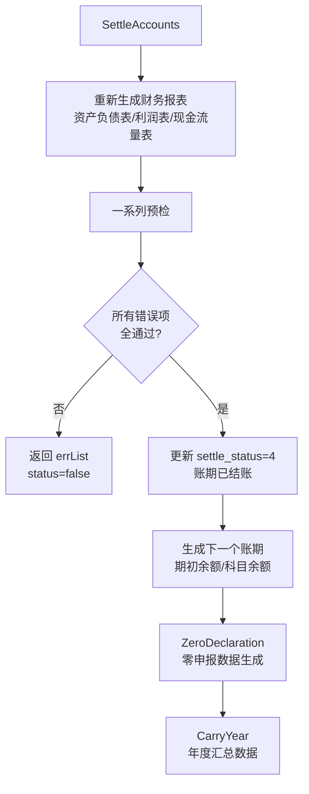
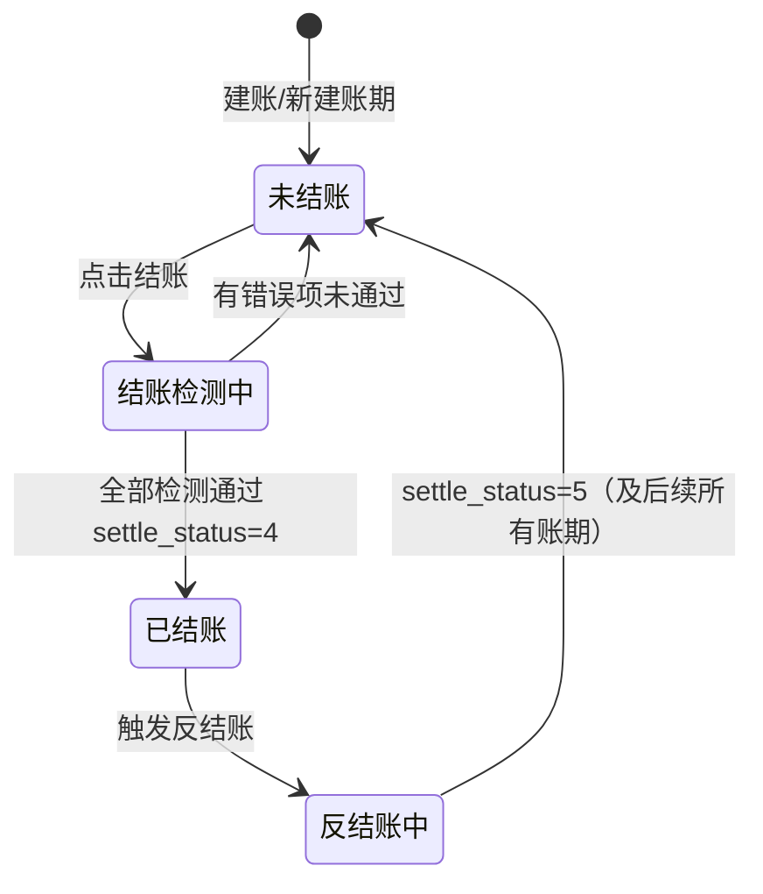

好，代码读完了，下面完整讲解「结转与结账」模块。

---

## 模块整体结构

```
api/carryover/
  api.go       ← 大部分接口
  period.go    ← 账期列表
  one.go       ← 批量取数单企业结账

service/s_ea/
  carryover_jzsy.go  ← 损益结转（核心）
  carryover_jz.go    ← 期末结账主流程（核心）
  carryover_asset.go ← 固定资产折旧结转
  carryover_salary.go← 工资结转
  carryover_zero.go  ← 零申报结转
  carryover_year.go  ← 年末结转
  carryover_one.go   ← 批量结账
  carryover_info.go  ← 结账信息查询
  carryover_gs.go    ← 结账时税表生成

router/ea/carryover.go ← 路由注册（18个接口）
```

---

## 五大功能逐一讲解

---

### 1. 损益结转（`ProfitAndLoss`）

**是什么**：把收入类（5*）、成本费用类（6*）科目的余额结转到「本年利润」（3103），使这些损益类科目期末余额归零。

**入口**：`POST /carryover/profitAndLoss`

**执行前的预检项**（`carryover_jzsy.go` 里的 `ErrList` 系列调用）：

| 检查项                 | 错误级别 | 通过标准               |
| ---------------------- | -------- | ---------------------- |
| 科目余额与凭证一致性   | 错误     | 余额表与凭证发生额匹配 |
| 清单凭证是否已生成     | 错误     | 发票凭证已生成         |
| 工资是否已计提         | 提示     | 本月已计提             |
| 固定资产折旧是否已计提 | 提示     | 本月已计提             |
| 凭证断号检测           | 错误     | 无断号                 |
| 税金是否已计提         | 错误     | 已计提                 |

**只有所有「错误」级别全通过**，才会真正执行损益结转（生成凭证把 5*/6* 结到 3103）。

**行业特殊逻辑**：行政事业单位（`ComKj5`）用 `InitSyjzMbf`，其余用 `InitSyjz`；民办非营利组织 12 月不检查本年利润余额。

---

### 2. 期末结账（`SettleAccounts`）

**是什么**：锁定某账期（`settle_status = 4`），之后该账期凭证不能再修改。是整个财务流程的"闭环"动作。

**入口**：`POST /carryover/checkOut`（单企业或多企业并发）、`POST /carryover/batchCheckOut`（批量）

**核心流程**（`carryover_jz.go` → `SettleAccounts`）：



**预检项**（共约 20 项）：

| 检查内容              | 级别                   |
| --------------------- | ---------------------- |
| 清单凭证已生成        | 错误                   |
| 工资已计提            | 提示/错误（可配置）    |
| 固定资产折旧已计提    | 提示                   |
| 凭证无断号            | 错误                   |
| 资产负债表平衡        | 错误                   |
| 损益类科目余额为零    | 错误                   |
| 财务报表已生成        | 错误                   |
| 税金已计提            | 错误                   |
| 12月：本年利润=0      | 错误                   |
| 现金/银行余额赤字     | 提示（某机构升为错误） |
| 成本>收入（成本倒挂） | 提示                   |
| 广告费超标            | 提示                   |
| 福利费超标            | 提示                   |
| 业务招待费超标        | 提示                   |

**批量结账**（`BatchCheckOut`）：并发度限制 10，3 秒内未完成自动返回「后台执行中」，各企业串行按期处理（防止前期未结直接结后期）。

---

### 3. 反结账（`ReverseCheckout`）

**是什么**：撤销某账期及其之后所有账期的结账状态，恢复为可编辑（`settle_status = 5`）。

**关键设计**：反结账操作是**向后级联**的——若反结 202503，则 202503、202504、202505… 等所有 ≥ 202503 的账期都会被反结账，防止后期账依赖前期已结数据。

```go
// 找出 com_id 下 period >= 传入期 的所有账期全部改为5
txMain.Where("com_id = ? and period >= ?", v.ComId, v.Period).Find(&periods)
for _, period := range periods {
    period.UpdateOne(utils.H{"settle_status": "5", "jz_time": time.Time{}}, txMain)
}
```

**操作日志**：会调用 `utils.LogRecord` 留存操作轨迹，第三方集成（一诺等）还有 webhook 回调。

---

### 4. 年末结转（`CarryYear`）

**是什么**：在某年度结账后，生成全年 1-12 月的汇总数据（科目余额、存货余额、辅助核算余额等），供年度报表和汇算清缴使用。

**触发时机**：通过 MQ（RabbitMQ）异步触发，在期末结账成功后发消息，`MqCarryYear` 消费执行。

**受机构开关控制**：`org.CarryYear != 1` 时直接跳过（并非所有机构都开启年末汇总）。

**执行内容**：对年内每个账期：

- 若账期未存在，生成科目余额表（`MakeSubject`）
- 复制辅助核算余额（`CopyFzhsPeriod`）
- 复制存货期初余额（`CopyInventoryPeriod`）
- 联动资产数据

---

### 5. 零申报结转（`ZeroDeclaration`）

**是什么**：当某企业本期无业务（零申报），自动执行一套完整的数据准备流程，省去人工操作。

**触发时机**：期末结账成功后自动调用（在 `SettleAccounts` 末尾）。

**执行内容**（`carryover_zero.go`）：

```
复制上期工资表 → 工资结转（多种工资类型）→ 资产折旧结转
  → 生成增值税表（小规模/一般纳税人分支）
  → 生成附加税/企业所得税/文化事业建设税/工会经费/水利/垃圾处理/消费税/残保金...
```

本质是把"正常月"需要人工一步步操作的动作，对「零申报企业」**全自动批量跑一遍**，降低代账会计的操作量。

---

## 接口清单（路由速查）

```
POST /carryover/profitAndLoss     损益结转
POST /carryover/carryOverAsset    资产折旧结转
POST /carryover/salaryCarryOver   工资结转
POST /carryover/jzSubject         科目结转（制造/贸易等）
POST /carryover/zdTradeCheck      贸易核算结转
POST /carryover/zdProduceCheck    生产核算结转
POST /carryover/checkOut          期末结账（单/多企业）
POST /carryover/batchCheckOut     批量结账
POST /carryover/getCheckOutPeriod 获取待结账账期列表
POST /carryover/reverseCheckout   反结账（级联）
POST /carryover/getPeriods        账期状态列表
POST /carryover/getCarryOverInfo  结账页面 info
POST /carryover/getUnclosed       往期未结账企业数
POST /carryover/risk              风险评测
POST /carryover/voucherFx         汇兑损益凭证生成
POST /carryover/linkAgeAll        联动账期（批量补期）
POST /carryover/carrOverList      结转记录查询
POST /carryover/carryOverOne      批量取数结账
```

---

## 账期状态流转



---

## 关键设计点

1. **结账 ≠ 申报**：结账是锁定财务账，申报是向税务局提交，两者独立。
2. **预检分「错误/提示」两级**：提示项允许存在，错误项必须全部通过才能结账（某些机构可通过配置把提示升为错误）。
3. **损益结转必须在结账前做**：结账预检里会验证损益类科目余额=0，否则拦截。
4. **反结账级联是单向的**：只能往后级联，不能跨企业，保护数据一致性。
5. **零申报企业全自动化**：减少代账会计对无业务企业的重复操作。
