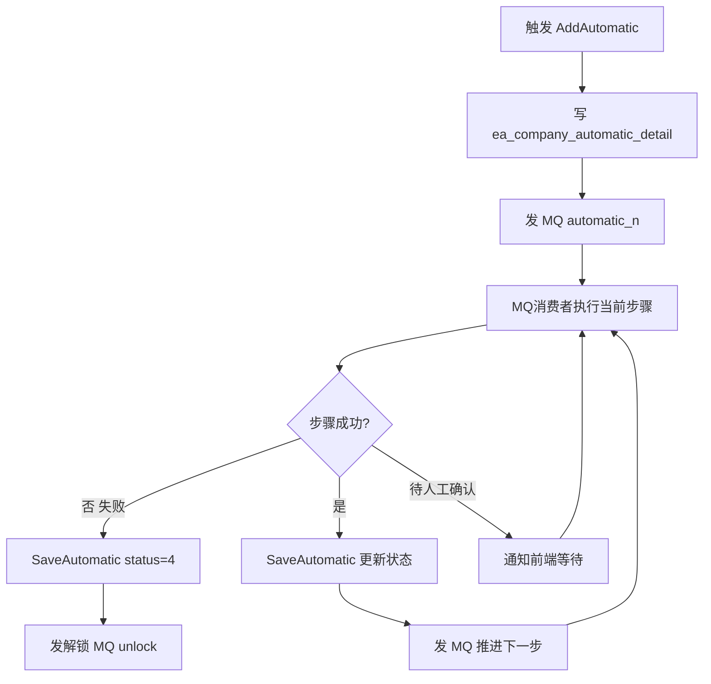

好，以下是【板块二十九】自动化记账模块的完整解析。

---

## 板块二十九：自动化记账

### 核心定位

这是整个系统中**最复杂的核心板块之一**，本质是一个**全流程自动化流水线（"工厂"）**，从采集发票数据开始，一路走到申报扣款结账，全程无人工干预。可理解为：**代账公司一个按钮，系统替你把一个企业一个月的记账报税全做完。**

---

## 一、自动化工厂的完整流程（15个步骤）

代码中 `add.go` 里定义了流程顺序：

```go
rw := []string{"qc", "gx", "fpcj", "yhcj", "gscj", "djqr", "bc", "pz", "jz", "zj", "skqr", "sb", "kkqr", "kk", "jc"}
```

对应含义：

| 步骤代码 | 中文含义 | 说明 |
|---------|---------|------|
| `qc` | 期初 | 检查账期初始状态 |
| `gx` | 勾选认证 | 进项发票勾选抵扣 |
| `fpcj` | 发票采集 | 从税务局采集进销项发票 |
| `yhcj` | 银行采集 | 从银行自动采集流水 |
| `gscj` | 工资采集 | 采集工资数据 |
| `djqr` | 单据确认 | 人工确认发票/银行/工资单据 |
| `bc` | 补充 | 补充发票明细、业务类型等信息 |
| `pz` | 生成凭证 | 一键生成凭证（调 `OneKeyVoucher`） |
| `jz` | 结账 | 期末结账（调 `SettleAccounts`） |
| `zj` | 质检 | 质量检查确认 |
| `skqr` | 税款确认 | 确认税款金额 |
| `sb` | 申报 | 发起税务申报任务 |
| `kkqr` | 扣款确认 | 确认扣款金额 |
| `kk` | 扣款 | 发起税款扣款 |
| `jc` | 检查结束 | 全流程完成 |

---

## 二、任务驱动方式（MQ 消息队列）

这是整个模块最核心的设计。每一步完成后**不直接调下一步函数**，而是发 MQ 消息，由消费者来执行下一步：

```go
// 发送到 automatic / automatic1~29 （按 comId%30 分桶）
b, _ := json.Marshal(model.AutoMaticParam{ComId, ReqNo, Period, Step})
utils.MqSend(MqAutomaticName + comId%30, b)
```

- 测试机构走 `automatic_cs` 专用队列。
- 生产按 `comId%30` 分到 30 个队列，避免单队列堵塞。
- 状态更新也单独走 `save_automatic` 队列（写库分离）。

---

## 三、步骤状态码（`s_auto/common.go` 注释说明）

```
1 排队中   2 执行中   3 成功
4 失败     5 部分成功  6 无需操作
7 跳过     8 超时处理跳过   9 确认申报暂不扣款
```

步骤成功（3/6/7/8）才触发推进下一步；失败（4）则停止并发解锁 MQ。

---

## 四、启动模式（`Type` 参数）

| Type | 含义 | 行为 |
|------|------|------|
| `0` | 从头启动 | 全流程跑 |
| `1` | 从失败处继续 | 找到第一个未成功的步骤重新开始 |
| `2` | 智能记账模式 | 跳过采集和申报，只跑 `bc → pz → jz` |
| `3` | 补账模式 | 清册开始，但勾选/确认/申报等步骤均跳过 |

---

## 五、功能点解析（对应你列出的4条）

### 1. 智能识别发票自动生成凭证

- 对应步骤 `pz`，实际调用 `s_ea.OneKeyVoucher` + `FunOneKeyVoucher`。
- 进/销/银行/费用/现金/票据全部自动跑一遍。

### 2. 自动分词识别（结巴分词 Jieba）

位于 `service/s_automatic/s_jieba/jieba.go`：

- 通过 **RPC** 连接远程 Jieba 服务（生产内网 `172.28.200.147:11223`）。
- 输入：发票行项目名称（如 `*电子元件*晶体管`）。
- 逻辑：先按 `*` 分割取中间短名称在 `ssfl_list`（税收分类编码库）里找候选项，再用 Jieba 分词+相似度打分，取最高分的税收分类编码。
- 主要用于**自动补充发票明细的税收分类编码（ssflbm）**。

### 3. 自动匹配科目

- `bc` 步骤（补充），对应 `service/s_automatic/bc.go`、`bc_in_invoice_item.go` 等文件。
- 通过**行业类型（`Ywlx`）+ 企业设置**自动将发票行项目匹配到对应会计科目。
- 同时也会调 `znfm.go` 中 `GetZnfm(...)` 接口（`public.listensoft.net`）自动识别税收分类。

### 4. 社保公积金自动计算

位于 `service/s_automatic/shebao.go`，包含 4 个函数：

| 函数 | 说明 |
|------|------|
| `CjShebaoAuto` | 采集社保数据（`shebaocj` 步骤） |
| `SbShebaoAuto` | 申报社保（`shebaosb` 步骤） |
| `KkShebaoAuto` | 扣款社保（`shebaokk` 步骤） |
| `JcShebaoAuto` | 检查社保结果（`shebaojc` 步骤） |

这 4 步均调用 `s_sendTax.FunSendTask(...)` 发起税务任务（RPA 机器人），并通过 `SaveAutomaticShebao` 更新对应状态，且支持地区校验（`IsSupported`）。

---

## 六、企业自动化设置（`ea_company_automatic_setting`）

`setting.go` 中 `SaveCompanyAutoSetting` 管理的字段超过 50 个，核心开关举例：

| 字段 | 含义 |
|------|------|
| `cjqr` | 是否需要发票确认 |
| `bankqr` | 是否需要银行确认 |
| `salaryqr` | 是否需要工资确认 |
| `sblx` | 申报类型（0完整申报/1只记账） |
| `gx` | 是否勾选认证 |
| `fyzdzg` | 费用是否暂估 |
| `chbc` | 是否自动补充业务类型 |
| `jdcj` | 小规模是否定期采集 |

---

## 七、整体架构图

