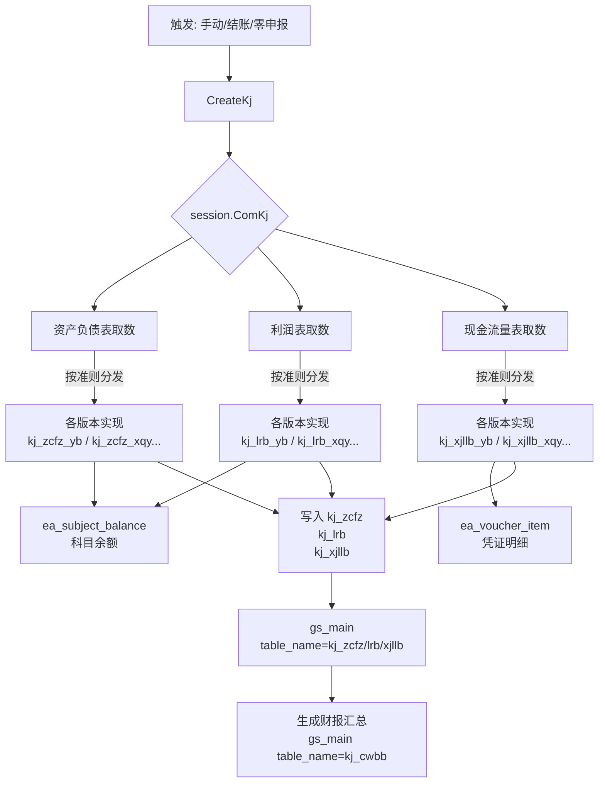

财务报表
好，代码都读完了，以下是完整讲解。

---

## 模块整体结构

```
api/kj/
  kj_zcfz.go      ← 创建三张报表的入口接口（CreateKj）
  origin.go       ← 利润表取数来源自定义配置
  transtition.go  ← 报表过渡相关
  zero.go         ← 零申报取数

service/s_ea/
  kj_zcfz*.go     ← 资产负债表（多准则版本，共11个文件）
  kj_lrb*.go      ← 利润表（共10个文件）
  kj_xjllb*.go    ← 现金流量表（共9个文件）
  kj_common.go    ← 财务报表写入 gs_main
  kj_transition.go← 准则切换处理
```

---

## 核心设计：多会计准则 × 三张报表

这是这个模块**最关键的架构特点**。系统支持 9 种会计准则，三张报表**各自对应不同的取数逻辑**：

| `ComKj` | 准则名称 | 资产负债表 | 利润表 | 现金流量表 |
|---------|---------|----------|--------|----------|
| `ComKj1` | 小企业会计准则2013 | `ZcfzXqykjzz` | `CreateLrbXqy` | `XjllbXqy` |
| `ComKj2` | 一般企业会计准则 | `ZcfzYb` | `CreateLrbYb` | `XjllbYb2` |
| `ComKj3` | 企业会计制度 | `ZcfzQyhjzd` | `CreateLrbQykjzd` | `XjllbXqy` |
| `ComKj4` | 一般准则(新金融) | `ZcfzYbYzx` | `CreateLrbYbYzx` | `XjllbYb2` |
| `ComKj5` | 民办非 | `ZcfzMbf` | `CreateLrbMbf` | `XjllbMbf` |
| `ComKj6` | 农业合作社 | `ZcfzHzs_New` | `CreateLrbHzs` | `XjllbXqy` |
| `ComKj7` | 一般准则(全科目) | `ZcfzYb_New` | `CreateLrbYb_New` | `XjllbYb2` |
| `ComKj8` | 一般准则(新金融全科目) | `ZcfzYbYzx_New` | `CreateLrbYbYzx_New` | `XjllbYb2` |
| `ComKj9` | 专业合作社 | `zcfzZyHzs_New` | `CreateLrbZyHzs` | 同 XjllbXqy |

入口是同一个 `ZcfzCreate / LrbCreate / XjllbCreate`，内部用 `if session.ComKj == ...` 分发到各自实现。

---

## 触发方式（三个入口）

### 1. 手动取数
- `POST /taxCalculation/createKj`
- 参数：`zcfz: 1`、`lrb: 1`、`xjllb: 1` 可分别控制只重算哪张

### 2. 期末结账时自动触发
- `SettleAccounts` 里第一步就调 `ZcfzCreate / LrbCreate / XjllbCreate`
- 保证结账前报表是最新状态

### 3. 零申报全自动流程
- `ZeroDeclaration` 里也会触发

---

## 三张报表逐一说明

### 一、资产负债表（zcfz）

**是什么**：反映某时刻企业资产、负债、所有者权益的"快照"表。

**取数逻辑核心**（`kj_zcfz_yb.go` 中 `ybWzxQm` 为例）：

从 `ea_subject_balance`（科目余额）里取各科目**期末余额**，按报表行号映射写入 `kj_zcfz`。例如：

```go
// 货币资金 = 1001（库存现金）+ 1002（银行存款）+ 1012（其他货币资金）借方余额之和
SumSubjectBalanceKj(subjectBalances, []string{"1001","1002","1012"}, 1, &hbzj, codes)
saveZcfzQm1(main.ID, 1, hbzj.Sum, 1, tx)  // 行1，期末余额
```

**重分类（cfl）机制**：这是一个重要的特殊逻辑，企业/机构可配置 `code_zcfz_cfl` 参数：

| 值 | 含义 |
|----|------|
| `1/2` | 全部重分类（应收/应付贷方余额重分类到对方） |
| `3/4` | 明细账重分类（逐科目判断方向再重分类） |
| `5` | 应收应付重分类 |
| 默认 | 不重分类 |

这处理了一种常见会计场景：**应收账款（1123）出现贷方余额时，应展示到应付账款（2202）中**，反之亦然。

**年初余额逻辑**：
- 默认从上季度报表复制年初数据（`oldPeriod = utils.LastJiDu`）
- 若企业设置 `code_zcfz_sj=yes`（税局模式），则从 `ea_subject_balance` 取上年末余额自动填充年初

---

### 二、利润表（lrb）

**是什么**：反映某账期的收入、成本、利润状况，展示三列：**本月数、本期累计（季度）、本年累计**。

**取数逻辑核心**（`kj_lrb_yb.go` 中 `CreateLrbYb` 为例）：

从 `ea_subject_balance` 取本期发生额，三列分别取：
- 本月：当期 `period_int / period_out`
- 本期累计（季度）：`utils.GetThisJdPeriod(period)` 汇总季度内所有月份
- 本年累计：累加全年各月

```go
// 营业收入 = 5001 + 5051 科目的贷方（Type=2）发生额
sumMonth1, sumPeriod1, sumYear1 := SumSubjectBalanceKjLrb(
    subjectBalance, subjectBalances,
    []string{codes["code5001"], codes["code5051"]}, 2)
saveLr(main.ID, 1, sumPeriod1, sumYear1, tx)
```

**研发费用特殊处理**：销售费用/管理费用里的「研发费用」子科目，会被单独提取出来填到「研发费用」行，并从原费用行扣减（避免重复计入）。

**所得税年缴模式**（`setSdsYear`）：部分企业选择按年缴所得税，此时利润表在年中账期的所得税行会按特殊规则取数，不按季度核算。

---

### 三、现金流量表（xjllb）

**是什么**：反映某账期的现金流入/流出情况，分经营/投资/筹资三大类活动。

**取数逻辑**（比前两表复杂）：

不能只从科目余额取——因为两笔发生额相抵后余额可能为零，但实际现金流动过，所以**要从凭证明细（`ea_voucher_item`）逐笔分析**：

```go
// 核心逻辑（kj_xjllb_common.go）：
// 找「同时包含 1001/1002（现金/银行）且包含某业务科目」的凭证
// 才认定为现金流动
func findVoucherSum(vouItems [][]model.EaVoucherItem, codes codeXjllb, code map[string]string, ...) float64 {
    // 遍历凭证，同时满足：
    // 1. 含有目标业务科目（如5001收入）且方向匹配
    // 2. 含有1001/1002且方向匹配
    // 则取该凭证的1001/1002金额作为现金流
}
```

分三段：
- **经营活动**（A1-A7）：销售收款、采购付款、缴税、支付工资等
- **投资活动**（B8-B13）：买卖固定资产、投资等
- **筹资活动**（C14-C19）：借贷款、引入投资、还款、分红等

---

## 数据存储结构

三张报表统一存入 `gs_main`（申报主表）+ 各自明细表：

```
gs_main
  table_name = "kj_zcfz" / "kj_lrb" / "kj_xjllb"
  method = "system"（系统取数）或 "collection"（采集/手改）

kj_zcfz        ← 资产负债表行数据
kj_lrb         ← 利润表行数据
kj_xjllb       ← 现金流量表行数据

kj_zcfz_template ← 各准则的表格行模板（用于初始化空表）
```

`method` 区分系统自动计算和手工录入：若手工修改了某张报表（`method != system`），结账时检测到就不再自动覆盖（`CheckGsMainHand`）。

---

## 完整流程图



---

## 关键设计点

1. **准则分发统一入口**：三个 `*Create` 函数都只做一个 `if/else if` 分发，具体实现完全分离到不同文件，新增准则只需新增文件+加一个 `else if`。
2. **手工修改保护**：`method != system` 标记保护用户手改的数据不被系统覆盖（除非用户主动"重新取数"传 `zcfz=1`）。
3. **现金流量表复杂度最高**：需要凭证级别分析，其他两表只需科目余额级别分析。
4. **民办非有时间分支**：`session.Period < "202601"` 用老版本，`>= "202601"` 用新版本，这是政策变更导致的兼容逻辑。
5. **报表与税表同库存储**：三张财务报表和增值税、所得税等税表都存在 `gs_main` 里，通过 `table_name` 字段区分，统一走税务申报查询入口。