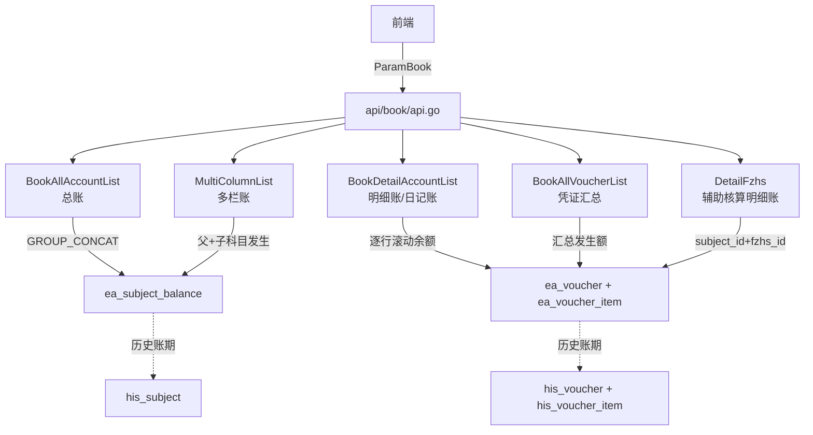

好，代码读完了，下面给你完整讲解账簿查询模块（板块十七）。

---

## 模块整体结构

```
api/book/api.go          ← 唯一接口文件（6个接口）
service/s_ea/
  book_allVoucher.go     ← 凭证汇总
  book_allAccount.go     ← 总账
  book_detailAccount.go  ← 明细账 / 日记账
  book_dlz.go            ← 多栏账
  book_fzhs.go           ← 辅助核算明细账
router/ea/book.go        ← 路由注册
```

---

## 路由注册（6个接口）

```8:16:router/ea/book.go
func BookRoute(api *gin.RouterGroup) {
	bookApi := api.Group("/book")
		bookApi.POST("/bookAllVoucherList", book.BookAllVoucherList)       //凭证汇总
		bookApi.POST("/bookAllAccountList", book.BookAllAccountList)       //总账
		bookApi.POST("/bookDetailAccountList", book.BookDetailAccountList) //明细账 日记账
		bookApi.POST("/multiColumnList", book.MultiColumnList)             //多栏账
		bookApi.POST("/detailFzhsList", book.DetailFzhsList)               //辅助核算明细账 左侧列表
		bookApi.POST("/detailFzhs", book.DetailFzhs)                       //辅助核算明细账
```

所有接口都共用同一个查询参数结构 `model.ParamBook`：

```14:44:model/req.go
type ParamBook struct {
	ComId            uint     // 企业ID
	BeginTime        string   // 开始账期（如 202501）
	EndTime          string   // 结束账期
	Level            int      // 科目层级（1=一级科目，2=两级...）
	SubjectId        uint     // 指定科目ID
	SubjectCode      string   // 科目编码
	FzhsItemId       uint     // 辅助核算明细ID
	Not0             bool     // 余额不为0才显示
	FseNot0          bool     // 本期发生额不为0才显示
	From             string   // 来源，如"日记账"
	OptionType       string   // 普通/数量金额/外币
	Deficit          bool     // 只看赤字（余额为负）
	VoNoSt/VoNoEd   string   // 凭证号区间
	OmitFse0Month    bool     // 省略无发生额月份
```

---

## 五种账簿逐一讲解

### 1. 总账（`BookAllAccountList`）

**是什么**：展示每个科目在各账期的期初、本期发生、期末余额汇总，一行一个科目，按账期横向展开。

**数据来源**：`ea_subject_balance`（科目余额表），用 `GROUP_CONCAT` 把多个账期数据聚合成逗号分隔字符串，前端再解析展开。

```sql
SELECT
    s.CODE, s.NAME,
    GROUP_CONCAT(period ORDER BY period) AS period,
    GROUP_CONCAT(period_begin_in ORDER BY period) AS period_begin_in,
    GROUP_CONCAT(period_end_in ORDER BY period) AS period_end_in,
    GROUP_CONCAT(period_int ORDER BY period) AS period_int,
    ...
FROM ea_subject_balance sb LEFT JOIN ea_subject s ON s.id = sb.subject_id
WHERE com_id=? AND period BETWEEN ? AND ?
GROUP BY s.CODE
```

**历史账期兼容**：若账期在 `his_subject` 历史区间内（旧数据迁移进来的），自动切换 SQL 查历史表；横跨历史/正常账期时分两次查询再合并。

**参数 `Level`**：控制 SQL 里 `LENGTH(CODE) - LENGTH(REPLACE(CODE,'.',''))` 过滤，限制只返回几级科目。

---

### 2. 明细账 / 日记账（`BookDetailAccountLists`）

**是什么**：展示某个科目（或所有科目）的每一笔凭证明细，逐行显示日期、凭证号、摘要、借贷金额、期末余额。

**日记账复用同一接口**，只是传参 `From: "日记账"`，排序改为按 `voucher_date` 排序而非按账期+凭证号排序。

**核心 SQL 逻辑**（明细账）：
```sql
SELECT v.period, v.voucher_no, v.voucher_date,
       vi.summary, vi.in_amount, vi.out_amount,
       vi.subject_id
FROM ea_voucher v, ea_voucher_item vi
WHERE v.id = vi.voucher_id
  AND v.com_id = ? AND v.period = ? AND vi.subject_id = ?
ORDER BY v.period, REPLACE(voucher_no,'记','')+0
```

**期末余额逐行累计**：`book_detailAccount.go` 中对每一行发生额叠加，计算出滚动期末余额（`EndAmount`）。

**特殊处理**：
- `Deficit: true`：只显示余额为负的行（赤字模式）
- `OptionType == "2"`：数量金额模式，会额外展示 `Count`、`Price` 列
- `OptionType == "3"`：外币模式，展示 `WbInAmount`、`WbOutAmount`、`Rate`
- 历史账期同样切换到 `his_voucher` + `his_voucher_item` 查询

---

### 3. 凭证汇总（`BookAllVoucherList`）

**是什么**：按科目统计账期区间内的本期发生额（借方合计/贷方合计），不展示明细，是总账的"汇总压缩"版。

**特殊能力**：支持 `VoNoSt/VoNoEd` 凭证号区间过滤（`记1~记50` 之间的发生额），用：
```sql
cast(substring(voucher_no, 2) as SIGNED) >= ? AND ... <= ?
```
把「记N」的数字部分转成整数再比较。

---

### 4. 多栏账（`MultiColumnList`）

**是什么**：展示一个**父级科目**下所有**子科目**各自的发生额，每个子科目一栏，横向对比。常见于"管理费用明细账"这类场景。

**数据结构**：
```go
type MultiColumnListRespSt struct {
    Subject      EaSubjectBalance   // 父科目余额
    SubjectLower []EaSubjectBalance // 所有子科目余额
    Vouchers     []MultiColumnListSt // 凭证明细
}
```

**取「最下级」子科目**的逻辑：遍历所有匹配科目，如果某个科目的 code 是另一个的前缀，就不要它（取叶子节点）：
```go
for _, v := range eaSubjectBalanceLower2 {
    status := true
    for _, z := range eaSubjectBalanceLower2 {
        if strings.Contains(z.SubjectCode, v.SubjectCode+".") {
            status = false  // 有下级，不是叶子，跳过
        }
    }
    if status {
        eaSubjectBalanceLower = append(...)
    }
}
```

---

### 5. 辅助核算明细账（`DetailFzhs`）

**是什么**：在科目维度基础上，再细分到**辅助核算项目**（部门、客户、供应商、项目等），每个辅助核算项目下展示该科目的逐笔流水和余额。

**两个接口**：
- `DetailFzhsList`：左侧列表，返回该科目下所有辅助核算项目（`ea_fzhs_item` 列表）
- `DetailFzhs`：右侧明细，传入 `SubjectId + FzhsItemId`，查某个辅助核算维度下的明细账

```sql
-- 辅助核算明细账的核心 SQL
SELECT v.period, v.voucher_no, v.voucher_date, vi.*
FROM ea_voucher_item vi, ea_subject s, ea_voucher v
WHERE v.id = vi.voucher_id
  AND v.com_id = ? AND v.period = ?
  AND vi.subject_id = ?         -- 指定科目
  AND vi.fzhs_id = ?            -- 指定辅助核算项目
ORDER BY v.period, REPLACE(voucher_no,'记','')+0
```

---

## 模块整体关系图



---

## 一个关键设计点：历史账期双轨

所有账簿接口都要处理"历史账期"（企业迁移进来的旧数据），代码里有大量类似：
```go
if common.PeriodIsOld(period, param.ComId, txMain) {
    // 查 his_voucher / his_subject
} else {
    // 查 ea_voucher / ea_subject_balance
}
```

这是因为主库 `ea_*` 表只存正常账套数据，历史导入的数据放在 `his_*` 表，账簿查询要把两段数据无缝拼在一起展示给用户。